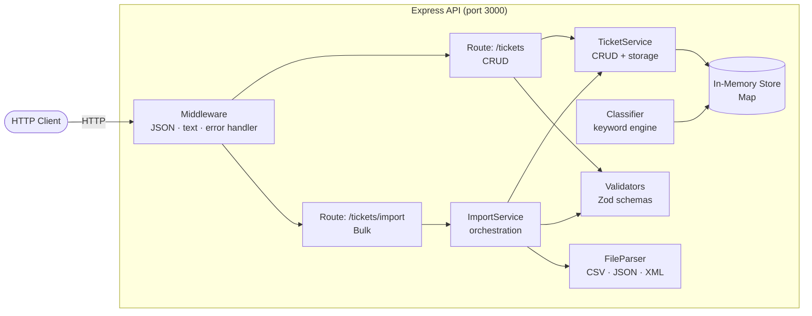
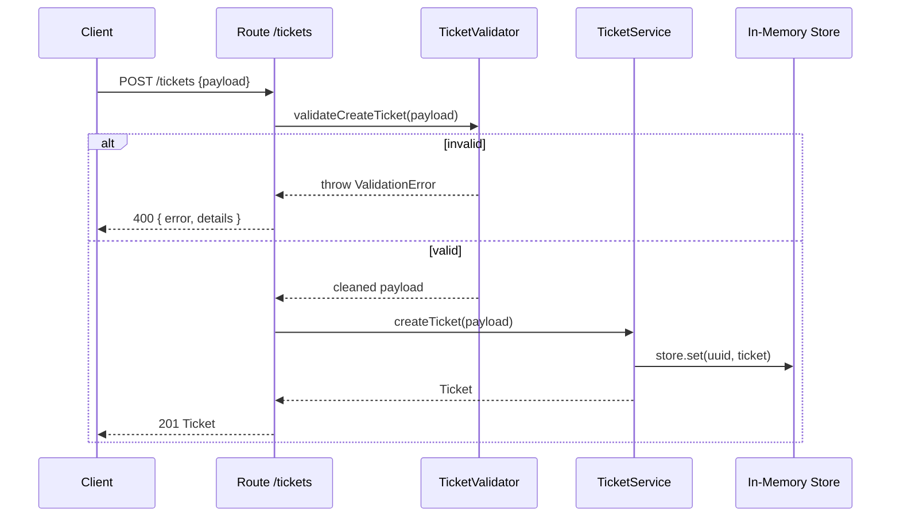
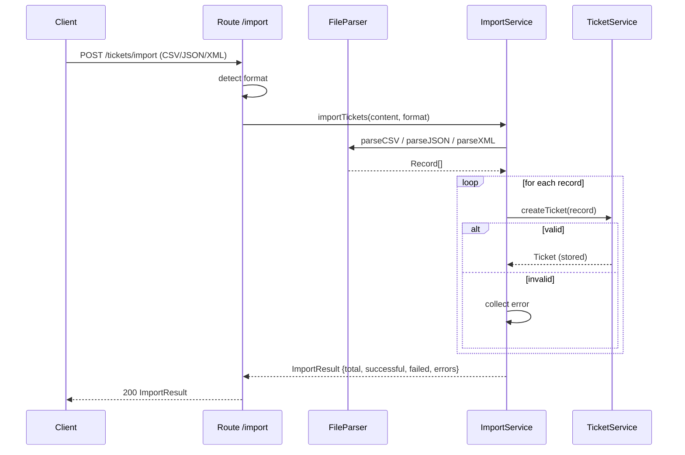

# Architecture

> **Generated with**: Claude Opus 4.7  
> **Audience**: Technical Leads

---

## High-Level Architecture

---

## Component Descriptions

### Routes (`src/routes/`)

| File          | Responsibility                                               |
|---------------|--------------------------------------------------------------|
| `tickets.ts`  | Handles POST, GET, GET/:id, PUT/:id, DELETE/:id              |
| `import.ts`   | Handles POST /tickets/import; detects format, delegates work |

Routes are thin: they validate HTTP semantics, delegate to services, and format responses. No business logic lives here.

### Services (`src/services/`)

| File                 | Responsibility                                                       |
|----------------------|----------------------------------------------------------------------|
| `ticket-service.ts`  | All CRUD operations; owns the `Map<id, Ticket>` in-memory store      |
| `import-service.ts`  | Orchestrates parsing → validation → creation; returns ImportResult   |
| `classifier.ts`      | Keyword-based category and priority classification; logs decisions   |

`TicketService` is the single source of truth for ticket state. All writes go through it.

### Validators (`src/validators/`)

| File                    | Responsibility                                          |
|-------------------------|---------------------------------------------------------|
| `ticket-validator.ts`   | Zod schemas for create/update payloads; email, length checks |
| `import-validator.ts`   | Per-format structure rules and error normalization      |

Validation is always synchronous and throws `ValidationError` on failure, which the error handler maps to a `400` response.

### Utilities (`src/utils/`)

| File               | Responsibility                                            |
|--------------------|-----------------------------------------------------------|
| `file-parser.ts`   | Low-level CSV (csv-parse), JSON, XML (fast-xml-parser) parsing |
| `error-handler.ts` | Custom error classes; Express error middleware             |

### Models (`src/models/ticket.ts`)

All TypeScript enums and interfaces live here. This file is the contract shared by every other module — change it and the compiler flags every downstream inconsistency immediately.

---

## Data Flow

### Single Ticket Creation

### Bulk Import Flow

---

## Design Decisions and Trade-offs

### In-Memory Storage

**Decision**: Use `Map<string, Ticket>` rather than a database.

**Why**: This is an MVP/learning project. An in-memory store eliminates setup overhead, enables instant test teardown via `clearStore()`, and keeps the focus on API design.

**Trade-off**: Data is lost on restart. To persist across restarts, replace `TicketService` with a repository backed by SQLite or PostgreSQL — no other module needs to change.

---

### Zod for Validation

**Decision**: Use Zod schemas instead of manual field-by-field checks.

**Why**: Zod gives type-safe parsing, composable schemas, and structured error messages in a single pass. `validateCreateTicket` returns a fully-typed object, eliminating downstream `undefined` checks.

**Trade-off**: Zod adds ~50 KB to the bundle. Acceptable for a server-side API.

---

### Keyword-Based Classifier

**Decision**: Use deterministic keyword matching instead of an LLM call in `classifier.ts`.

**Why**: Zero latency, zero API cost, fully testable, and sufficient for common ticket patterns.

**Trade-off**: Low recall for novel phrasing. Tickets that match no keyword default to `category: other, priority: medium`. To improve accuracy, replace `classifyTicket` with a call to `claude-haiku-4-5` and keep the same function signature — callers do not need to change.

---

### Error Recovery in Bulk Import

**Decision**: Continue processing after individual record failures; return a summary.

**Why**: A 500-row CSV with one bad email should not silently discard 499 valid tickets. Partial success with a detailed error list lets operators fix and re-import only the failures.

**Trade-off**: Clients must check `failed > 0` rather than relying solely on HTTP status codes. This is documented in `API_REFERENCE.md`.

---

## Security Considerations

- **No authentication**: All endpoints are public. For production, add JWT or API key middleware in `src/app.ts` before route registration.
- **Input sanitization**: Zod schemas reject unexpected fields; no raw SQL or shell execution exists.
- **No file system access**: Import accepts request body strings, never file paths — no path traversal risk.

## Performance Considerations

- **Filtering is O(n)**: `getAllTickets` iterates the entire map. For >10 000 tickets, add an index map keyed by `status`, `category`, and `priority`.
- **Synchronous parsing**: `parseCSV` / `parseXML` are synchronous and block the event loop for large files. Move to streaming parsers for imports >1 MB.
- **No connection pooling**: In-memory storage means no DB pool to tune; relevant only after adding a real database.
