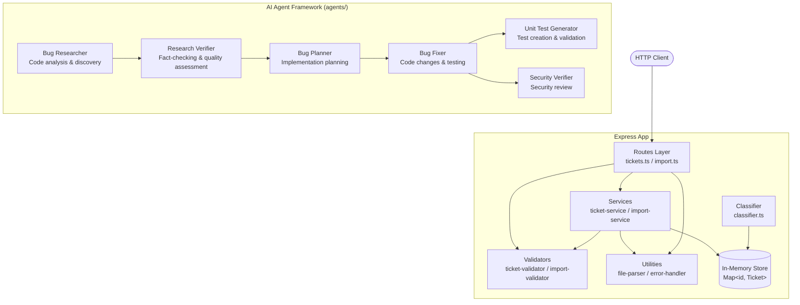

# Customer Support Ticket Management System

> **Purpose**: Demonstration of AI-powered bug research, verification, and automated fix implementation workflow  
> **Audience**: Developers, QA Engineers

A Node.js + TypeScript REST API for managing customer support tickets with multi-format bulk import (CSV, JSON, XML), in-memory storage, keyword-based auto-classification, and integrated AI agent framework for bug discovery and remediation.

---

## Features

- Full CRUD operations for support tickets
- Bulk import from CSV, JSON, and XML files with per-record error recovery
- Auto-classification of tickets by category and priority using keyword matching
- Zod-based schema validation with detailed error messages
- Consistent JSON error responses across all endpoints
- 56-test suite achieving >85% code coverage
- **AI Agent Framework** for automated bug research, verification, planning, and fixing
- Structured bug context and implementation plan tracking

---

## Architecture



---

## Project Structure

```
homework-4/
├── src/
│   ├── app.ts                  # Express middleware setup
│   ├── index.ts                # Server entry point (port 3000)
│   ├── config.ts               # Environment variable loader
│   ├── models/ticket.ts        # TypeScript interfaces and enums
│   ├── routes/
│   │   ├── tickets.ts          # CRUD endpoints
│   │   └── import.ts           # Bulk import endpoint
│   ├── services/
│   │   ├── ticket-service.ts   # CRUD + in-memory storage
│   │   ├── import-service.ts   # Bulk import orchestration
│   │   └── classifier.ts       # Keyword-based auto-classification
│   ├── validators/
│   │   ├── ticket-validator.ts # Zod schemas for ticket fields
│   │   └── import-validator.ts # File format validation
│   └── utils/
│       ├── file-parser.ts      # CSV / JSON / XML parsers
│       └── error-handler.ts    # Error mapping and Express middleware
├── agents/
│   ├── bug-researcher.agent.md         # Codebase analysis agent
│   ├── research-verifier.agent.md      # Verification agent
│   ├── bug-planner.agent.md            # Planning agent
│   ├── bug-fixer.agent.md              # Implementation agent
│   ├── unit-test-generator.agent.md    # Test generation agent
│   └── security-verifier.agent.md      # Security review agent
├── context/bugs/
│   ├── 1/
│   │   ├── bug-context.md
│   │   ├── research/
│   │   │   ├── codebase-research.md
│   │   │   └── verified-research.md
│   │   ├── implementation-plan.md
│   │   ├── fix-summary.md
│   │   ├── test-report.md
│   │   └── security-report.md
│   └── ...
├── skills/
│   ├── research-quality-measurement.md
│   └── unit-tests-FIRST.md
├── tests/
│   ├── test_ticket_api.ts      # API endpoint tests (11)
│   ├── test_ticket_model.ts    # Data validation tests (9)
│   ├── test_import_csv.ts      # CSV import tests (6)
│   ├── test_import_json.ts     # JSON import tests (5)
│   ├── test_import_xml.ts      # XML import tests (5)
│   ├── test_categorization.ts  # Classifier tests (10)
│   ├── test_integration.ts     # End-to-end tests (5)
│   ├── test_performance.ts     # Benchmark tests (5)
│   └── fixtures/               # Sample CSV / JSON / XML data
├── demo/                       # Quick-start scripts and sample data
├── AGENTS.md                   # Agent framework overview
├── ARCHITECTURE.md             # Technical architecture details
├── HOWTORUN.md                 # Setup and execution instructions
├── API_REFERENCE.md            # API endpoint documentation
├── INSTRUCTIONS.md             # Project requirements
├── TASKS.md                    # Homework tasks and checklist
└── VERIFICATION_REPORT.md      # Agent workflow results summary
```

---

## Installation & Setup

**Prerequisites**: Node.js v18+, npm v9+

```bash
# 1. Navigate to the project directory
cd homework-4

# 2. Install dependencies
npm install

# 3. Copy environment template (if available)
cp .env.example .env

# 4. Start the development server (hot-reload)
npm run dev
```

The server starts at `http://localhost:3000`.

---

## How to Run Tests

```bash
# Run all 56 tests
npm test

# Watch mode (re-runs on file save)
npm run test:watch

# Coverage report (target >85%)
npm run test:coverage
```

Coverage report is written to `coverage/lcov-report/index.html`.

---

## AI Agent Workflow

The agent framework automates bug discovery, verification, planning, and fixing:

1. **Bug Researcher** — Analyzes the codebase and produces detailed research reports
2. **Research Verifier** — Fact-checks research against source code and assigns quality levels
3. **Bug Planner** — Determines eligibility and creates implementation plans using auto-pick rules
4. **Bug Fixer** — Applies code changes and validates with tests
5. **Unit Test Generator** — Creates FIRST-principle tests for changed code
6. **Security Verifier** — Reviews fixed code for security vulnerabilities

See [AGENTS.md](./AGENTS.md) for detailed agent roles and invocation examples.

---

## AI Agent Model Strategy

The six agents are split into two performance tiers based on task complexity and correctness criticality:

### Heavy Reasoning & Correctness-Critical Agents

These agents perform complex analysis, verification, and security review where mistakes are expensive. They use **frontier-class models** optimized for accuracy:

- **Bug Researcher** — Requires deep code analysis across files, exact line numbers, and complex pattern matching
- **Research Verifier** — Must fact-check claims verbatim against source code with high precision
- **Security Verifier** — Security oversights have high impact; requires thorough threat modeling
- **Bug Fixer** — Executes implementation plans with mandatory test validation; failures block downstream work

**Model Stack** (2026 pricing):

- Primary: `gpt-5.4` ($2.50 input / $15 output per 1M tokens)
- Fallback 1: `claude-sonnet-4.6` ($3 / $15)
- Fallback 2: `gemini-2.5-pro` ($1.25 / $10)

**Rationale**: These agents handle tasks where correctness is non-negotiable. Higher capability justifies 3–6x higher per-token cost versus economy tier.

### Structured & Cost-Optimized Agents

These agents work within tightly constrained scopes where correctness is bounded by rules and rubrics. They use **mid-tier models** that balance capability with speed and cost:

- **Bug Planner** — Applies deterministic auto-pick rules; output quality gates on status × quality matrix
- **Unit Test Generator** — Follows FIRST principles in a structured test framework; no free-form invention

**Model Stack** (2026 pricing):

- Primary: `gpt-5.4 mini` ($0.75 input / $4.50 output per 1M tokens)
- Fallback 1: `claude-haiku-4.5` ($1 / $5)
- Fallback 2: `gemini-2.5-flash` ($0.30 / $2.50)

**Rationale**: Constrained scope means lower token spend per task. Cheaper models execute 4–6x faster and cost 70–80% less, reducing latency and cumulative cost while maintaining output quality within defined guardrails.

### Cost Impact

For typical workflows processing 5–10 bugs:

- Heavy reasoning agents: ~50–100K tokens per bug (correctness > cost)
- Planning agents: ~10–20K tokens per bug (speed + cost priority)
- **Estimated monthly savings vs. uniform frontier tier**: 40–50% reduction

---

## Quick API Reference

| Method | Endpoint        | Description               |
| ------ | --------------- | ------------------------- |
| POST   | /tickets        | Create a single ticket    |
| GET    | /tickets        | List tickets (filterable) |
| GET    | /tickets/:id    | Get ticket by ID          |
| PUT    | /tickets/:id    | Update ticket fields      |
| DELETE | /tickets/:id    | Delete a ticket           |
| POST   | /tickets/import | Bulk import CSV/JSON/XML  |

See [API_REFERENCE.md](./API_REFERENCE.md) for full request/response examples.

---

## Environment Variables

| Variable  | Default     | Description         |
| --------- | ----------- | ------------------- |
| PORT      | 3000        | HTTP server port    |
| NODE_ENV  | development | Runtime environment |
| LOG_LEVEL | debug       | Logging verbosity   |

---

## Related Documentation

| File                                               | Audience           |
| -------------------------------------------------- | ------------------ |
| [AGENTS.md](./AGENTS.md)                           | Agent developers   |
| [API_REFERENCE.md](./API_REFERENCE.md)             | API consumers      |
| [ARCHITECTURE.md](./ARCHITECTURE.md)               | Technical leads    |
| [HOWTORUN.md](./HOWTORUN.md)                       | All users          |
| [INSTRUCTIONS.md](./INSTRUCTIONS.md)               | Project overview   |
| [TASKS.md](./TASKS.md)                             | Homework checklist |
| [VERIFICATION_REPORT.md](./VERIFICATION_REPORT.md) | Results summary    |
